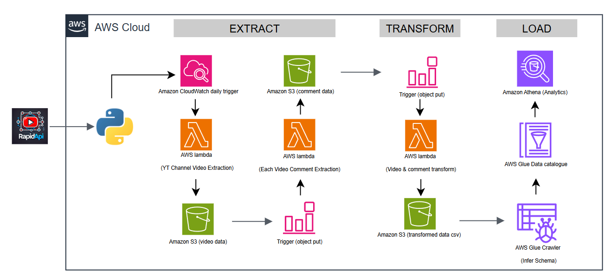

# Complete Data Pipeline Data Engineering Project using rapidapi
- The Idea is to constantly track all the videos & its commments on a given channel
API:
- https://rapidapi.com/ytdlfree/api/youtube-v31/playground/apiendpoint_97d8b02c-86e0-40d3-a693-261448a32499
Subscribe for basic plan
- Free 500 request/day (They changed it to 200 request/month now 🙄)

## Summary
Integrating with Rapid API and extracting Youtube Data
Deploying code on AWS Lambda for Data Extraction
Adding trigger to run the extraction automatically
Writing transformation function
Building automated trigger on transformation function
Store files on S3 properly
Building Analytics Tables on data files using Glue and Athena
